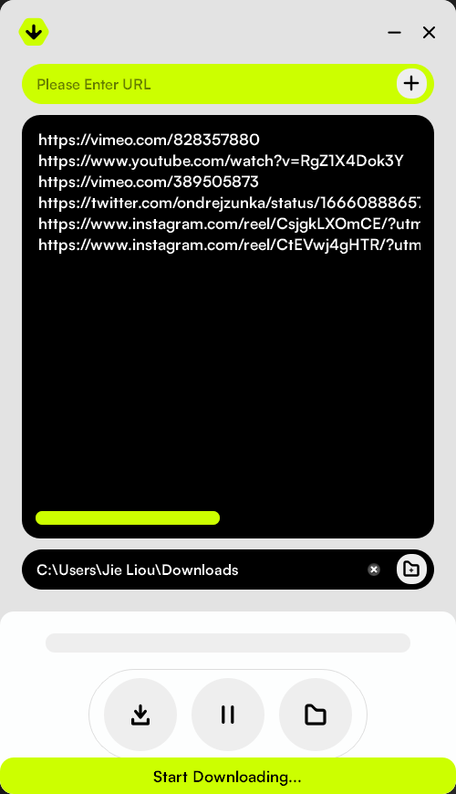

Dowdle is an easy-to-use video downloader. All codes were generated with the assistance of ChatGPT. This project aims to develop a user-friendly interface and a handy tool using GPT4. Dowdle allows you to download videos from many websites. However, it's crucial to adhere to local laws and respect copyright when using this tool.

## **Download Link**

[Google Drive](https://drive.google.com/drive/folders/1dsVgH8NIt6kY3KN02aHDfXjz2SbAchcK?usp=sharing)

⚠️ Note: The MacOS version is compatible with MacOS 13 and above.

## **Usage & Limitations**

- Simply open the Dowdle.exe or Dowdle.app file - there's **no installation needed**!
- Paste a video URL and click '**Download**'.
- If you have multiple videos to download, just paste the video URLs, then click the '**Add**' button or press '**Enter**'.
- Even better, you can copy a link, then click the '**Add**' button or press '**Enter**'. The link will automatically be added to the list.
- By default, the download path is set to your '**Downloads**' folder. However, you can customize this location as per your preference.
- Dowdle relies on yt-dlp for downloading videos. Sometimes, certain websites may temporarily block downloads. If this happens, you might need to wait for a while or for a new release of the software.
- In case of a new release, whether for bug fixes or new features, a notification will pop up when you launch the app.

## **Disclaimer & Terms of Use**

By using this application, you agree to the following:

### **Acceptance**

Your use of this application signifies your acceptance of these terms. If you do not agree with these terms, please refrain from using this application.

### **Copyright**

This application serves as an interface to content hosted elsewhere. You are responsible for ensuring that any media accessed or downloaded through this application does not violate the copyright laws in your jurisdiction.

### **Content**

You must have the appropriate rights to access and use all content. This application does not endorse or encourage unlawful activity, including copyright infringement.

### **Liability**

We will not be liable for any loss or damage arising from the use of this application.

Changes: We may modify these terms at any time. It is your responsibility to review these terms periodically.

### **Governing Law**

These terms are governed by the laws of [Your Jurisdiction].

